# Bounty Hacker

---

>#### Write-Up by VESPAS 
>##### ***Written and Redacted by:*** Gabriel Rossetto (R0SSETT0)

__

Esse é um write-up da máquina Bounty Hacker, da plataforma TryHackMe, que fez parte do Processo Seletivo do projeto de extensão VESPAS da UTFPR de 2025.1.

Essa máquina é inspirada no anime Cowboy Bebop e aprofunda alguns conceitos interessantes sobre hacking. Então vamos começar!

## Reconhecimento

Normalmente, a primeira coisa que fazemos ao começar um desafio, é o reconhecimento. Depois de ligar a máquina, conseguir o IP, e se conectar à VPN do THM, eu costumo rodar o NMAP com dois scripts diferentes.

- O primeiro deles:
  
_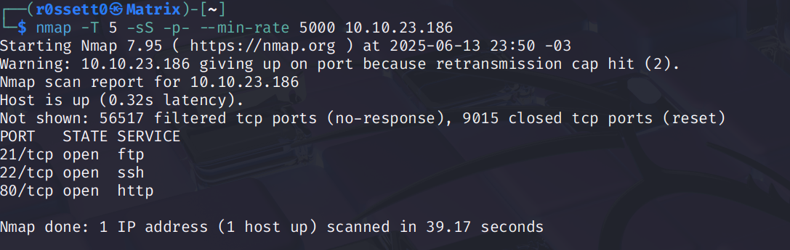_

``` bash
nmap -T 5 -sS -p- --min-rate 5000 <IP>
```
Esse comando basicamente executa uma varredura em todas as portas de um ``IP``, usando a flag ``-p-``. Como isso demoraria muito tentando uma conexão padrão, utilizamos as flags:
- ``-T 5`` -> para dividir o envio de pacotes em 5 threads (o máximo suportado pelo NMAP)
- ``-sS`` -> para enviar o tipo mais simples de conexão (SYN)
- ``--min-rate`` -> para escolher o número mínimo de pacotes enviados pelo NMAP em determinado intervalo de tempo (acho que são segundos)

- PS: O número ``5000`` especificado na flag ``--min-rate`` é um valor que utilizo na **MINHA** máquina. Talvez seja um valor alto demais ou até baixo demais pra sua máquina. Vale a pena tentar começar com um número menor e ir aumentando gradativamente até achar um valor ideal.

- O segundo script:

_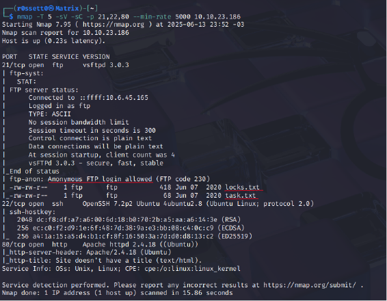_

``` bash
nmap -T 5 -sV -sC -p <PORTAS,ESPECIFICAS> --min-rate 5000 <IP>
```
As diferenças do comando anterior são as flags:
- ``-sV`` e ``-sC`` -> essas flags enviam respectivamente, um pedido de conexão que retorna o tipo de serviço da porta, além da sua versão e outras especificações, e uma conexão que retorna algumas possíveis vulnerabilidades.
- ``-p`` -> como as conexões ``sV`` e ``sC`` são bem mais pesadas e lentas do que ``-sS``, só especifico as portas que sei que estão abertas, agilizando o processo de escaneamento.

Sei que a segunda imagem pode parecer um pouco ameaçadora, mas sublinhei as informações úteis para nossos próximos passos.

## Porta ftp

Após a etapa inicial, se checarmos a porta ftp vamos descobrir a existência de dois arquivos txt que serão necessários para conseguir a shell. Para isso, podemos conectar usando:
``` bash
ftp <IP>
```

_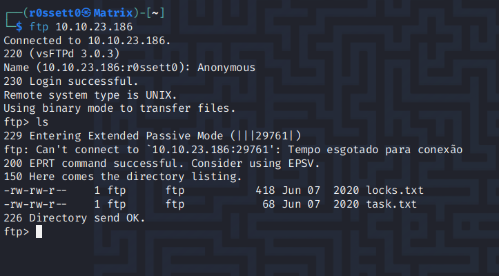_

Dentro do servidor ftp (File Transfer Protocol), temos um funcionamento similar à uma shell. Podemos usar o comando ``ls`` para listar os arquivos no servidor e utilizar o ``get`` para fazer o download para nossa máquina local. Por fim, usamos ``quit`` para sair do servidor.

_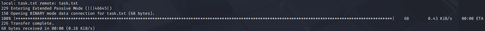_
_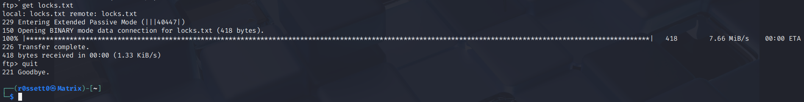_

###### O servidor ftp dessa box é bem lento, talvez sejam necessárias várias tentativas para baixar os arquivos. 

Em seguida, analisando os arquivos que baixamos vemos as seguintes mensagens:

_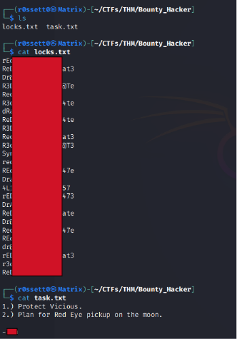_

Temos então a primeira "flag", quem escreveu a lista de tarefas e uma lista de senhas. Podemos usar essa lista para conseguir uma shell através do hydra.
_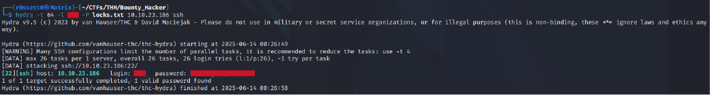_

Deu certo! Agora só precisamos conectar ao ssh!

_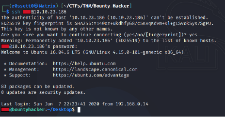_

Nesse ponto já podemos descobrir a flag do usuário:

_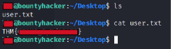_

Em seguida, temos que escalar privilégios para root. Tentei usar o comando ``sudo -l``e...

_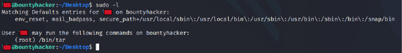_

Bingo! Descobrimos que podemos usar o comando ``tar`` como ``root``!

Se você tem alguma experiência com pentesting, sabe que essa é uma grande falha de segurança. Usuários comuns não deveriam ter acesso à rodar comandos utilizando sudo sem a senha.

Dando uma olhada no **GTFOBins**, vemos que o comando ``tar`` pode nos garantir uma shell sem a perda de privilégios!

_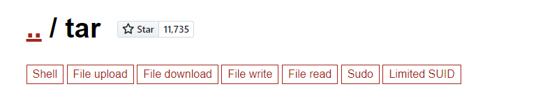_
_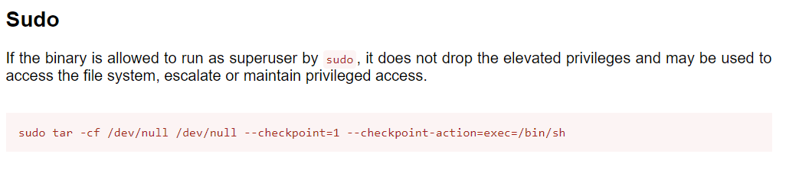_

Copiando o comando e colando ele exatamente como no site, temos o seguinte resultado:

_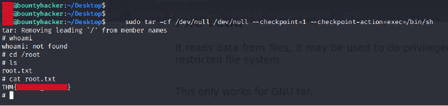_

**Root!** A partir desse ponto foi possível navegar até o diretório ``/root`` e conseguir a última flag para terminar a box.

Apesar de lembrar muito a Brooklyn 99, essa box foi bem divertida. Espero que tenham gostado do write-up, entendido tudo e aprendido coisas novas!
### Room finalizada!
