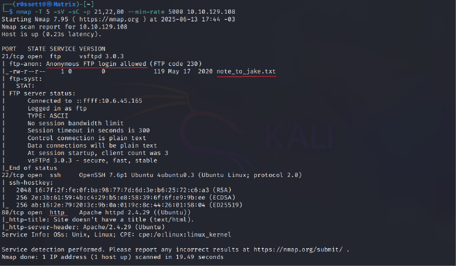

# Brooklyn 99

---

>#### Write-Up by VESPAS 
>##### ***Written and Redacted by:*** Gabriel Rossetto (R0SSETT0)

__

Esse é um write-up da máquina Brooklyn 99, da plataforma TryHackMe, que fez parte do Processo Seletivo do projeto de extensão VESPAS da UTFPR de 2025.1.

Essa é uma máquina introdutória que ensina diversos conceitos importantes e interessantes sobre hacking. Eu particularmente achei bem divertida. Vamos começar!

## Reconhecimento

Normalmente, a primeira coisa que fazemos ao começar um desafio, é o reconhecimento. Depois de ligar a máquina, conseguir o IP, e se conectar à VPN do THM, eu costumo rodar o NMAP com dois scripts diferentes.

- O primeiro deles:
__

``` bash
nmap -T 5 -sS -p- --min-rate 5000 <IP>
```
Esse comando basicamente executa uma varredura em todas as portas de um ``IP``, usando a flag ``-p-``. Como isso demoraria muito tentando uma conexão padrão, utilizamos as flags:
- ``-T 5`` -> para dividir o envio de pacotes em 5 threads (o máximo suportado pelo NMAP)
- ``-sS`` -> para enviar o tipo mais simples de conexão (SYN)
- ``--min-rate`` -> para escolher o número mínimo de pacotes enviados pelo NMAP em determinado intervalo de tempo (acho que são segundos)

- PS: O número ``5000`` especificado na flag ``--min-rate`` é um valor que utilizo na **MINHA** máquina. Talvez seja um valor alto demais ou até baixo demais pra sua máquina. Vale a pena tentar começar com um número menor e ir aumentando gradativamente até achar um valor ideal.

- O segundo script:
__

``` bash
nmap -T 5 -sV -sC -p <PORTAS,ESPECIFICAS> --min-rate 5000 <IP>
```
As diferenças do comando anterior são as flags:
- ``-sV`` e ``-sC`` -> essas flags enviam respectivamente, um pedido de conexão que retorna o tipo de serviço da porta, além da sua versão e outras especificações, e uma conexão que retorna algumas possíveis vulnerabilidades.
- ``-p`` -> como as conexões ``sV`` e ``sC`` são bem mais pesadas e lentas do que ``-sS``, só especifico as portas que sei que estão abertas, agilizando o processo de escaneamento.

Sei que a segunda imagem pode parecer um pouco ameaçadora, mas sublinhei as informações úteis para nossos próximos passos. Agora temos que tomar a decisão de qual caminho tomar.

Um pequeno spoiler, existem dois jeitos de completar essa box... Vou mostrar ambos nesse write-up, mas decidi começar com o caminho mais simples.

## Jake!

Se após a etapa inicial escolhermos checar a porta ftp, vamos descobrir a existência de uma mensagem importante. Para isso, podemos conectar usando:
``` bash
ftp <IP>
```
__

Dentro do servidor ftp (File Transfer Protocol), temos um funcionamento similar à uma shell. Podemos usar o comando ``ls`` para listar os arquivos no servidor e utilizar o ``get`` para fazer o download para nossa máquina local. Por fim, usamos ``quit`` para sair do servidor.
__

Em seguida, analisando o arquivo que baixamos vemos a seguinte mensagem:
__

Vendo isso, a primeira coisa que pensei foi tentar conectar à porta ssh utilizando o login ``jake``, e tentar descobrir a senha utilizando bruteforce com o hydra.
__

Deu certo! Agora só precisamos conectar ao ssh e usar as credenciais do jake.
__

Nesse ponto já podemos descobrir a flag do usuário, que está na home do holt. Eu fiz dessa maneira:
__

Em seguida, temos que escalar privilégios para root. Tentei usar o comando ``sudo -l``e...
__

Bingo! Descobrimos que jake pode usar o comando ``less`` como ``root``!

Se você tem alguma experiência com pentesting, sabe que essa é uma grande falha de segurança. Usuários comuns não deveriam ter acesso à rodar comandos utilizando sudo sem a senha.

Dando uma olhada no **GTFOBins**, vemos que o comando ``less`` pode nos garantir uma shell sem a perda de privilégios!
__
__

Copiando o comando e colando ele exatamente como no site, temos o seguinte resultado:
__
Apertando ``Ctrl``+``X``
__

**Root!** A partir desse ponto já é possível navegar até o diretório ``/root`` e conseguir a segunda flag para terminar a box, mas como eu disse antes no write-up...
__

#### Vamos explorar todos os caminhos!!!

## Holt
Se ao invés de acessarmos o servidor ``ftp`` após a etapa de reconhecimento, nós tivessemos checado o servidor ``http``, teríamos nos deparado com isso:
__

Esse site não parece ter nada de mais acontecendo, mas inspecionando a página temos uma dica:
__

Apesar do nome ``Steganografia`` ser muito difícil de se pronunciar (eu sempre falo errado rsrs), é muito mais simples do que soa.

Basicamente, ``Steganografia`` consiste em esconder informações em lugares inesperados, como uma imagem. Você não espera encontrar um arquivo numa imagem, por isso é um bom esconderijo.

Porém, fora o fator surpresa da ``Steganografia``, ela é facilmente decriptada, existindo várias ferramentas para extração de informações nas imagens.

Depois de baixar a imagem, tentei utilizar o ``steghide`` para extrair as informações da imagem. Porém, essa imagem foi encriptada com uma senha, senha essa que não sabemos.
Então o ``steghide`` nos é inútil. Por sorte, alguém já teve o mesmo problema, e criou o ``stegcracker``, que é basicamente a junção do ``steghide`` com o anteriormente mencionado ``hydra``.

Usando o ``stegcracker`` para extrair o arquivo da imagem temos:
__

Ele não apenas descobriu a senha como já gerou o arquivo de saída! Além de que ele utiliza a ``rockyou.txt`` do kali, caso o usuário não escolha outra wordlist. Muito conveniente!

Lendo o arquivo gerado, conseguimos descobrir a senha para conectar ao ``ssh`` como ``holt``:
__
__

Aqui podemos conseguir a flag do usuário como anteriormente, mas como já mostrei que ela está na ``/home`` do ``holt``, vou direto para o privilege escalation.

Rodando o ``sudo -l`` como antes vemos que ``holt`` também possui uma vulnerabilidade:
__

Novamente olhand no **GTFOBins**, vemos que o comando ``nano`` também pode nos garantir uma shell como root!
__
__

Dessa vez, temos primeiro que digitar o comando ``sudo nano``, para criar um arquivo para escrita.
__

Depois apertamos ``Ctrl``+``R`` para inserir o conteúdo de um arquivo no arquivo atual e logo em seguida ``Ctrl``+``X`` para inserir um comando ao invés de um arquivo. Em seguida, basta colar a última linha do comando do ```GTFOBins``` e temos uma shell!
__
__

Sim, é uma shell dentro do nano... Esquisita, mas funcional!

Depois de conseguir a shell como ``root``, é só correr pro abraço!
__

Espero que tenham gostado do write-up, entendido tudo e aprendido coisas novas! Essa box foi bem divertida e acho que é uma boa construção de alguns conceitos básicos de pentest.
### Room finalizada!