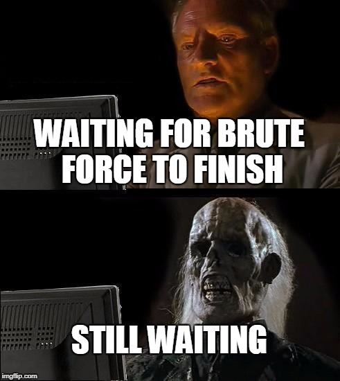

# Brute It

---

>#### Write-Up by VESPAS 
>##### ***Written and Redacted by:*** Gabriel Rossetto (R0SSETT0)

__

Esse é um write-up da máquina Brute It, da plataforma TryHackMe, que fez parte do Processo Seletivo do projeto de extensão VESPAS da UTFPR de 2025.1.

Essa é uma máquina um pouco intermediária que necessita de alguns conhecimentos chaves sobre hacking. Então vamos começar!

## Reconhecimento

A primeira ação que tomei foi rodar o NMAP para descobrir quais eram as portas abertas. Como de costume, rodo dois scripts:

- O primeiro deles:

__

``` bash
nmap -T 5 -sS -p- --min-rate 5000 <IP>
```
Esse comando basicamente executa uma varredura em todas as portas de um ``IP``, usando a flag ``-p-``. Como isso demoraria muito tentando uma conexão padrão, utilizamos as flags:
- ``-T 5`` -> para dividir o envio de pacotes em 5 threads (o máximo suportado pelo NMAP)
- ``-sS`` -> para enviar o tipo mais simples de conexão (SYN)
- ``--min-rate`` -> para escolher o número mínimo de pacotes enviados pelo NMAP em determinado intervalo de tempo (acho que são segundos)

- PS: O número ``5000`` especificado na flag ``--min-rate`` é um valor que utilizo na **MINHA** máquina. Talvez seja um valor alto demais ou até baixo demais pra sua máquina. Vale a pena tentar começar com um número menor e ir aumentando gradativamente até achar um valor ideal.

- O segundo script:

__

``` bash
nmap -T 5 -sV -sC -p <PORTAS,ESPECIFICAS> --min-rate 5000 <IP>
```
As diferenças do comando anterior são as flags:
- ``-sV`` e ``-sC`` -> essas flags enviam respectivamente, um pedido de conexão que retorna o tipo de serviço da porta, além da sua versão e outras especificações, e uma conexão que retorna algumas possíveis vulnerabilidades.
- ``-p`` -> como as conexões ``sV`` e ``sC`` são bem mais pesadas e lentas do que ``-sS``, só especifico as portas que sei que estão abertas, agilizando o processo de escaneamento.

Com isso, já é possível responder quase todas as perguntas da task 2. Só precisamos descobrir o diretório escondido para avançarmos.

A plataforma indica um comando do ``gobuster``. Normalmente utilizo o ``ffuf``, mas nesse caso usarei o comando indicado pela dica.

__

## Getting a shell

Indo até o diretório que descobrimos, encontramos uma página de login. Inspecionando a página descobrimos o usuário:

__

Usando o usuário descoberto e o ``hydra``, conseguimos descobrir a senha do login com brute force!

__

Temos então acesso à página do john, contendo uma chave rsa privada e a primeira flag!

__

Aqui está a chave rsa:

__

Vendo na plataforma, descobrimos que o id_rsa tem uma senha. Para descobrir a senha, podemos usar o john the ripper, com o comando a seguir:
``` bash
ssh2john rsa > hash.txt
john -w=/<CAMINHO_DA_WORDLIST> hash.txt
```

__

Nesse ponto já podemos conseguir uma shell, só precisamos dar permissões de autentificação para o id e usá-lo para logar através do ssh:

__

Em seguida, temos que escalar privilégios para root. Tentei usar o comando ``sudo -l``e...

__

Descobrimos que podemos usar o comando ``cat`` como ``root``!

Se você tem alguma experiência com pentesting, sabe que essa é uma grande falha de segurança. Usuários comuns não deveriam ter acesso à rodar comandos utilizando sudo sem a senha.

Dando uma olhada no **GTFOBins**, vemos que o comando ``cat`` pode nos garantir uma shell sem a perda de privilégios!

__
__

Usando o comando para descobrir os hashes das senhas dos usuários em ``/etc/shadow``, temos o seguinte resultado:

__

Podemos então copiar os hashes para um arquivo na nossa máquina local e usar o john para descobrir a senha do root:
``` bash
john -w=<CAMINHO_DA_WORDLIST> <nome_do_arquivo>
```

__

###### Eu esqueci de tirar o print com a senha à mostra, mas se rodar esse comando a senha deve aparecer em alguns segundos.

Conseguimos a senha do root! Poderíamos utilizar essa senha para logar como root na máquina, e conseguir a última flag. Mas tem um jeito mais fácil:

__

Esse foi o write-up! Essa box foi bem desafiadora pra mim, já que foi uma das primeiras que eu fiz, alguns meses atrás. Mas acho que para alguém de um nível já mais intermediário ela é uma máquina íncrivel para praticar!
### Room finalizada!
