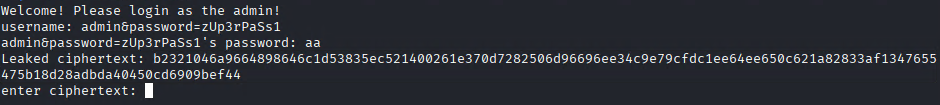

# Flip

---

>#### Write-Up by VESPAS 
>##### ***Written by:*** Caique Ferraz (frrz)
>##### ***Redacted by:*** Gabriel Rossetto (R0SSETT0)

__

Agora vamos falar da Flip, um desafio baseado em técnicas de criptografia. 

Nessa room nós iremos analisar um pouco de código e decriptar uma cifra baseada em Block cipher mode of operation (Modo de operação de cifra de bloco).

### O que é Block cipher mode of operation?

É importante antes de pularmos para a solução introduzir esse método de criptografia. O Block cipher mode of operation é uma técnica de criptografia que trabalha em cima de Block ciphers, ou cifra de bloco, esses blocos de cifra possuem uma entrada de tamanho fixo (e.g. b bits) e produzem um texto cifrado, ou ciphertext, de b bits também. Se o input for maior do que b bits, ele pode ser dividido em mais do que um bloco. Existem vários tipos de operações que utilizam de blocos de cifras, cada um utilizando de técnicas diferentes para contextos diferentes.

Em tempos mais primitivos às técnicas citadas, podemos citar a abordagem do ECB (Electronic Code Block), qual era um procedimento simplificado do funcionamento de cipherblocks. Essa técnica se tratava da encriptação de cada bloco diretamente, onde cada bloco iria possuir sua ciphertext e poderia ser encriptado e decriptado paralelamente, como mostra o exemplo:

__

Para o contexto desse desafio, vamos falar especificamente sobre o CBC (Cipher Block Chaining), técnica usada dentro da box. Essa técnica foi um aprimoramento da vista anteriormente, no CBC, depois de receber uma operação XOR, o bloco de cipher anterior serve como o input para o próximo bloco a ser encriptado. Resumindo, cada bloco de texto é XORado com o bloco cifrado anterior antes de ser criptografado. Ou seja, um cipherblock é produzido criptografando o resultado da operação de XOR entre o plaintext atual e o cipherblock anterior. O primeiro bloco usa um vetor de inicialização (IV) em vez de um bloco anterior.

Aqui está o processo: 

__

Então se fossemos resumir esse processo em uma fórmula, teremos:

Ci = EK(Bi ⊕ Ci-1), onde EK é o algoritmo de encriptação de block usando a chave K e Ci-1 é a cifra produzida pelo bloco Bi-1, com ⊕ representando a operação de XOR.

Então, similarmente, a decriptação usando o CBC pode ser feita usando a seguinte fórmula:

Bi = DK(Ci)⊕(Ci-1), onde DK simboliza o algoritmo de decriptação utilizando a chave K.

Portanto, entendido o básico de CBC e Block cipher mode encryption, vamos para a resolução.


### Resolução do desafio

- **Primeira task:** *....Baixar o source code!*

Bom, aqui só precisamos baixar o código fonte do desafio e já ganhamos uma task! Agora só falta…. tudo!

__

- **Segunda task:** *Qual é a flag?* (AKA. todo o resto)

Primeiramente somos convidados a conectar à porta 1337 da máquina, então vamos ver o que está nos esperando… Usando netcat, podemos conectar usando o comando:

```bash
nc <IP da máquina> 1337
```

Conectando, vemos:

__

*Opa, fácil assim? Lembro que no código que baixei tinha algo de username e senha…*

__

*É, parece que nem tão fácil assim.*

Bom, esse desafio é baseado em crypto, então nós devemos tentar achar uma cifra vazada para fazer operações em cima dela e tentar dar um bypass desse sistema de segurança acima. Dito isso, tentando mudar alguma letra do username:

__

Que conveniente, temos uma cifra vazada!

Agora dando uma atenção para o código, podemos observar:

__

A chave e o IV são gerados aleatoriamente ao iniciar a conexão e não são vazados, além disso, é solicitado ao usuário o username e senha quais são usados para formar uma string com o formato:

```bash
access_username=<username>&password=<senha>
```

Se o usuário e a senha solicitados forem o correto logo de cara, o script recusará, se não, fornece a cifra da string acima e pede a cifra fornecida para decriptação e verificação:

__

Se essa verificação for positiva, temos a flag, portanto, nossa missão é modificar a cifra fornecida para decriptar em um payload que contenha 
``admin&password=sUp3rPaSs1 ``.

Para modificar essa cifra encriptada, podemos usar a técnica de bit flip. Se nós pudermos controlar onde esse flip acontece, nós podemos criar uma mensagem encriptada, fornecendo os credenciais desejados, mas com alguma leve alteração de um caractere, assim, podemos “flippar” esse caractere para que a string final resulte nas credenciais desejadas.
### Voltando à teoria
Isso explicita como  a decriptação ocorre no CBC:

__

Mudar um bit do ciphertext acaba por mudar completamente o output da decriptação, afetando todos os bits no seu texto em plaintext, como visualizado em vermelho na imagem a seguir. Porém também afeta o bit unitário XORado, como visualizado em verde:

__

Então, se decidimos colocar a string "admin&password=zUp3rPaSs1" como o parâmetro de username, e a senha como "aa", a string formada pelo código será:

```bash
access_username=admin&password=zUp3rPaSs1&password=aa
```

No caso desse desafio, o CBC encripta em blocos de 16 bytes, se o bloco não chega a 16 bytes, ele recebe um “padding” ou um preenchimento no estilo pkcs7 até chegar a esses 16 bytes, isso vai resultar nos seguintes blocos:

- Bloco 1: ``access_username=``
- Bloco 2: ``admin&password=z``
- Bloco 3: ``Up3rPaSs1&passwo``
- Bloco 4: ``rd=aa\x0B\x0B\x0B\x0B\x0B\x0B\x0B\x0B\x0B\x0B\x0B``

Observamos que o primeiro bloco contém somente a string ``access_username=`` que não é relevante para a gente, como o código somente verifica se a string de verificação está presente no payload. Portanto, podemos escolher para flippar um bit no primeiro bloco para mudar um caractere no próximo bloco, com o preço da decriptação do primeiro bloco ser destruída.

Seguindo o payload acima, podemos mudar o último byte da letra do segundo bloco de z para s, para formar a senha correta. Para isso, o último byte do primeiro bloco tem que ser escolhido para dar ``‘algo’ xor ‘z’ = ‘s’``. Para escolhermos corretamente o valor ``‘algo’``, a fórmula pode ser trocada para ``‘algo’ = ‘z’ xor ‘s’``.
### Chgando na flag
Agora para realizar o ataque que planejamos, colocaremos o input de username e senha que analisamos:

__

Com isso, podemos construir um script python para fazer toda a manipulação da cifra que precisamos:

__

Aqui seguimos a técnica que foi discutida previamente, onde mudamos um bit estrategicamente no ciphertext, que é o último caractere do primeiro bloco (posição 16, que implica em posição 15 no array) para produzir o output que queremos. Assim, executando o script temos nossa cifra modificada:

__

Colocando a cifra modificada como entrada, recebemos nossa flag:

__

### Room finalizada!
