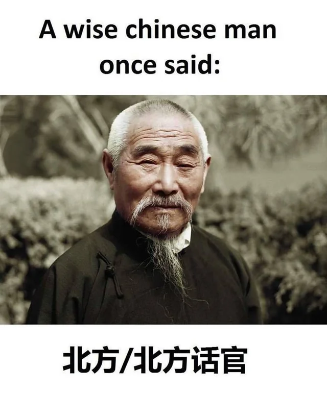

# W1seGuy

---

>#### Write-Up by VESPAS 
>##### ***Written by:*** Augusto Graeml (gra3ml)
>##### ***Redacted by:*** Gabriel Rossetto (R0SSETT0)

__

Analisando o código fonte disponibilizado podemos obter algumas informações importantes:
- A flag é enviada para nós criptografada utilizando XOR e encodada como hexadecimal
- O binário nos pede a chave utilizada na hora da criptografia XOR e assim libera a próxima flag!
- A chave é gerada pelas seguintes linhas de código:
__

- Ela é composta por letras e dígitos aleatórios formando uma chave de 5 caracteres.

#### Com isso poderíamos testar uma abordagem de *brute force* . Porém o nome da máquina é w1seman (homem sábio). Vamos tentar uma abordagem mais sábia!
	
- Sabemos alguns caracteres da flag com certeza: ``THM{...}``
	- A operação XOR é reversível portanto podemos utilizar isso a nosso favor!
	- Retirando os 4 primeiros bytes e o último do que nos foi dado teremos o equivalente à ``THM{}``. Podemos usar isso para descobrir a chave!
	
		__
	- Com o script acima podemos obter a chave e conseguir a segunda flag enviada pelo servidor.
	- Para conseguir a primeira flag, basta utilizar a chave encontrada para reverter o XOR do input que foi fornecido.
	__
	
### Room finalizada!