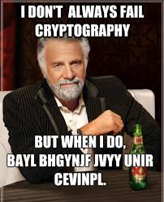
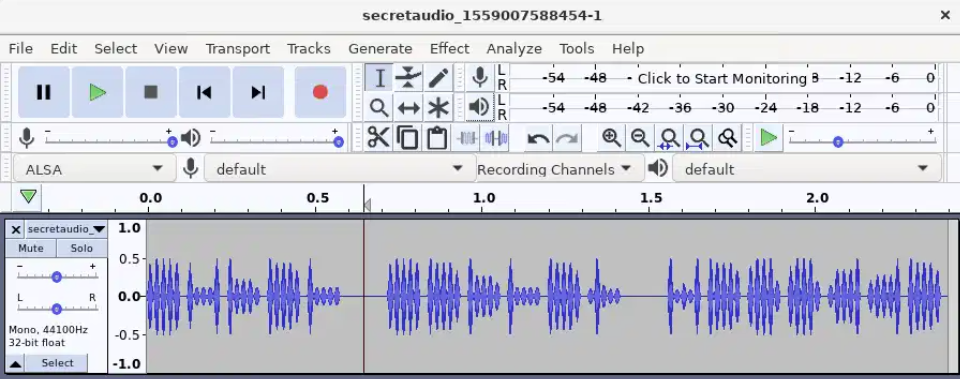
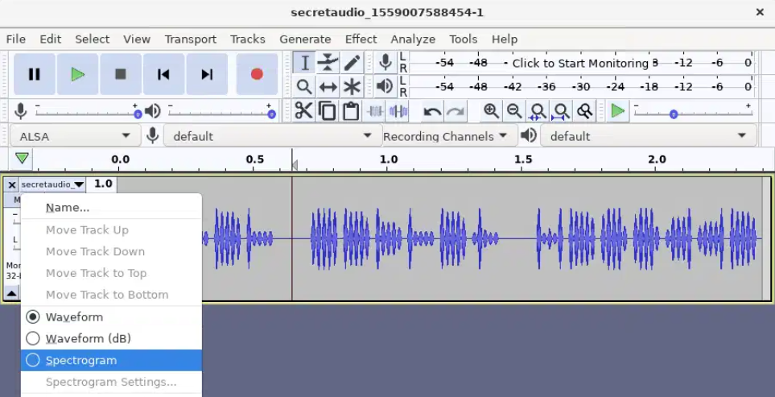
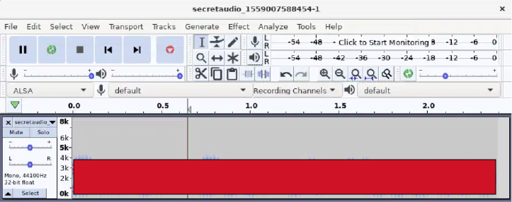
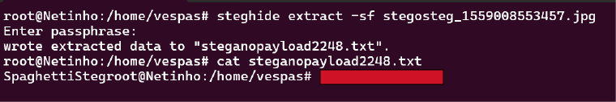
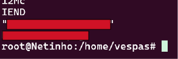

# C4pture-th3-fl4g

---

>#### Write-Up by VESPAS 
>##### ***Written by:*** Antônio Neto (anetogm)
>##### ***Redacted by:*** Gabriel Rossetto (R0SSETT0)

__

## Translation & Shifting

Este desafio é a primeira parte do desafio **c4ptur3-th3-fl4g**, que faz parte do processo seletivo do grupo de pesquisa em cibersegurança **VESPAS**.

Este write-up reúne uma série de desafios que envolvem diferentes tipos de codificação comuns em CTFs (Capture The Flag). Ao final, há também dicas úteis para identificar cada tipo de codificação!

> Parte dos resultados será censurada para atende as regras da plataforma.

### Desafio 1 — Leetspeak

- Texto: `c4n y0u c4p7u23 7h3 f149?`
- Tradução: `can you [REDACTED]`

### Desafio 2 — Binário

- Texto: `01101100 01100101 01110100 01110011 00100000 01110100 01110010 01111001 00100000 01110011 01101111 01101101 01100101 00100000 01100010 01101001 01101110 01100001 01110010 01111001 00100000 01101111 01110101 01110100 00100001`
- Resultado: `lets try [REDACTED]`

**Dica**: Se você ver apenas números 0 e 1 agrupados em blocos de 8 bits (ou seja, 8 dígitos), provavelmente é binário.

### Desafio 3 — Base32

- Texto: `MJQXGZJTGIQGS4ZAON2XAZLSEBRW63LNN5XCA2LOEBBVIRRHOM======`
- Resultado: `base32 is [REDACTED]`

**Dica**: Se só tem letras MAIÚSCULAS e números, e termina com `=`, pode ser Base32.

### Desafio 4 — Base64

- Texto: `RWFjaCBCYXNlNjQgZGlnaXQgcmVwcmVzZW50cyBleGFjdGx5IDYgYml0cyBvZiBkYXRhLg==`
- Resultado: `Each Base64 [REDACTED]`

**Dica**: Se o texto contém letras maiúsculas **e** minúsculas, números, `/`, `+` e termina com `=` ou `==`, quase certamente é Base64.

### Desafio 5 — Hexadecimal

- Texto: `68 65 78 61 64 65 63 69 6d 61 6c 20 6f 72 20 62 61 73 65 31 36 3f`
- Resultado: `hexadecimal or [REDACTED]`

**Dica**: Se é composto apenas por números de 0–9 e letras de A–F (ou a–f), separados por espaços ou colados, é hexadecimal.

### Desafio 6 — ROT13

- Texto: `Ebgngr zr 13 cynprf!`
- Resultado: `Rotate me [REDACTED]`

**Dica**: ROT13 mantém o mesmo tamanho da mensagem original e apenas troca letras por outras 13 posições depois no alfabeto.

### Desafio 7 — ROT47

- Texto: `*@F DA:? >6 C:89E C@F?5 323J C:89E C@F?5 Wcf E:>6DX`
- Resultado: `You spin [REDACTED]`

**Dica**: Se o texto contém vários caracteres especiais e parece uma bagunça de símbolos e letras, pode ser ROT47.

### Desafio 8 — Código Morse

- Texto: `- . .-.. . -.-. --- -- -- ..- -. .. -.-. .- - .. --- -.
. -. -.-. --- -.. .. -. --.`
- Resultado: `TELECOMMUNICATIO [REDACTED]`

**Dica**: Se vir pontos `.` e traços `-` separados por espaços, quase certeza que é Morse.

### Desafio 9 — Decimal (ASCII)

- Texto: `85 110 112 97 99 107 32 116 104 105 115 32 66 67 68`
- Resultado: `Unpack this [REDACTED]`

**Dica**: Se a mensagem for uma sequência de números entre 32 e 126, separados por espaços, é provável que represente caracteres ASCII decimais.

### Desafio 10

Este desafio misturou **Base64 ➝ Morse ➝ Binário ➝ ROT47 ➝ Decimal**.

- Texto codificado (recortado): `LS0tLS0gLi0tLS0gLi0tLS0gLS0tLS0gLS0tLS0gLi0tLS0g...`

**Processo de decodificação**:

1. Começa com `LS0...==`, indicando **Base64**.
2. O resultado tem `.` e `-`, sugerindo **Morse**.
3. Decodificando Morse resulta em números binários.
4. O binário decodifica para texto criptografado em **ROT47**.
5. Após aplicar ROT47, obtemos uma lista de valores decimais.
6. Por fim, ao converter os decimais em texto, obtemos a flag!

- Resultado: `Let's make [REDACTED]`

### Ferramenta Utilizada

- [CyberChef](https://gchq.github.io/CyberChef/)

### Dicas Gerais para Reconhecer Codificações

| Codificação         | Características típicas                                           |
| ------------------- | ----------------------------------------------------------------- |
| **Base64**          | Letras maiúsculas, minúsculas, números, termina com `=` ou `==`   |
| **Base32**          | Apenas letras MAIÚSCULAS e números, termina com `=`               |
| **Hexadecimal**     | Dígitos de `0–9` e letras `a–f`, geralmente separados por espaços |
| **Binário**         | Apenas `0` e `1`, normalmente em grupos de 8 bits                 |
| **Morse**           | Composto por `.` e `-`, separados por espaços                     |
| **ROT13**           | Texto criptografado ainda parece legível, mas com letras trocadas |
| **ROT47**           | Texto com muitos caracteres especiais                             |
| **Decimal (ASCII)** | Números entre 32 e 126 separados por espaços                      |

## Espectrograma

Para resolver este desafio, seguimos os passos abaixo:

1. Abra o arquivo de áudio em um editor como o **Audacity**.
   - Visualização no Audacity:
   
     __
     
2. Clique na setinha ao lado do nome da faixa de áudio e selecione a opção **"Espectrograma"** para alterar a visualização.

   - Isso revelará uma imagem oculta no espectro do som.
   - Exemplo da visualização espectral:
   
     __

3. A flag será visível na forma de texto codificado dentro do espectrograma.
   - Exemplo do resultado:
     
     __

**Flag encontrada!**

## Esteganografia

A princípio, tentei as abordagens tradicionais, mas foi necessário usar uma ferramenta específica de esteganografia.

### Tentativas Iniciais

Inicialmente, testei os seguintes comandos para tentar extrair informações escondidas da imagem:

- `binwalk stegosteg_1559008553457.jpg`  
  _Verifica dados embutidos em arquivos binários._

- `exiftool stegosteg_1559008553457.jpg`  
  _Verifica metadados da imagem._

- `strings stegosteg_1559008553457.jpg`  
  _Tenta encontrar strings legíveis no conteúdo binário._

### Solução com `steghide`

A imagem estava protegida usando **esteganografia real**, e foi necessário utilizar a ferramenta `steghide`:

#### Comando usado:

```bash
steghide extract -sf stegosteg_1559008553457.jpg
```

#### O que aconteceu:

- Ele pediu uma **passphrase** (senha), mas eu apenas pressionei **Enter**.
- Resultado no terminal:

```
wrote extracted data to "steganopayload2248.txt".
```

#### Conteúdo do `.txt` extraído:

Acessei o arquivo extraído com o comando:

```bash
cat steganopayload2248.txt
```

E ele retornou a flag!



### Dicas Gerais para Esteganografia

| Ferramenta | Quando usar                                                                 |
| ---------- | --------------------------------------------------------------------------- |
| `strings`  | Para buscar trechos legíveis em arquivos binários                           |
| `exiftool` | Quando se suspeita de metadados escondidos                                  |
| `binwalk`  | Para encontrar arquivos comprimidos embutidos                               |
| `steghide` | Quando a imagem pode conter dados realmente ocultos (criptografados ou não) |

## Security Through Obscurity

Desafio resolvido usando análise de strings ocultas em imagem JPG.

### Tentativas iniciais

Comecei com os comandos mais comuns para análise de esteganografia:

```bash
exiftool meme_1559010886025.jpg
binwalk meme_1559010886025.jpg
```

Nenhum deles trouxe resultados úteis.

### A solução veio com `strings`

Executei o comando abaixo:

```bash
strings meme_1559010886025.jpg
```

*Saída no terminal:*



Esse comando listou todos os textos legíveis dentro do arquivo binário da imagem.

### Room finalizada!
