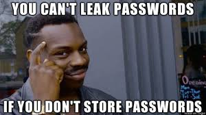
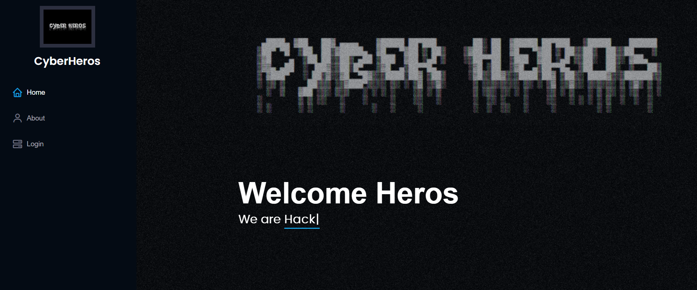
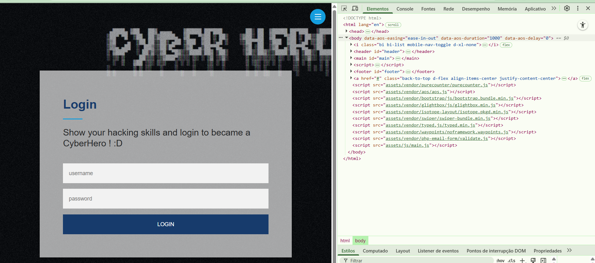
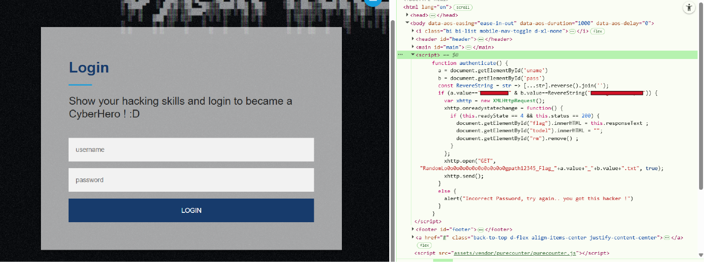
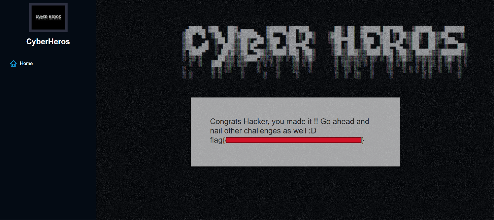

# Cyberheroes

---

>#### Write-Up by VESPAS 
>##### ***Written by:*** Antônio Neto (anetogm)
>##### ***Redacted by:*** Gabriel Rossetto (R0SSETT0)

__

## Abrindo a página
Pra começar, é necessário iniciar a VPN para estabelecer a conexão com o ambiente virtual.

Após isso, iniciamos a máquina do desafio e acessamos seu IP diretamente no navegador. Com isso, a página principal do desafio é carregada com sucesso:

**

## Inspecionando a página
Como se trata de um desafio baseado em uma aplicação web, o primeiro passo foi inspecionar para investigar possíveis vulnerabilidades. 

Na página inicial não havia nada de relevante, mas havia um formulário de login:

**

## Analisando o Script
Ao examinar o JavaScript da página, identifiquei um trecho que mostrava as credenciais de acesso:

**

Nesse script, o nome de usuário era exibido diretamente, enquanto a senha estava “ocultada” por uma função que invertia a string, então:
```
olpmexEeDahneS  →  SenhaDeExemplo
```

## Resposta
Com as credenciais decodificadas, foi possível realizar o login normalmente:

**

### Room finalizada!