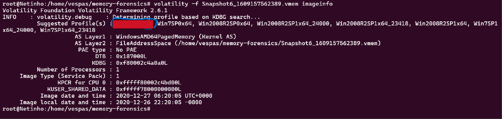
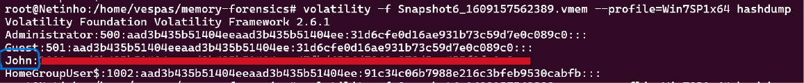
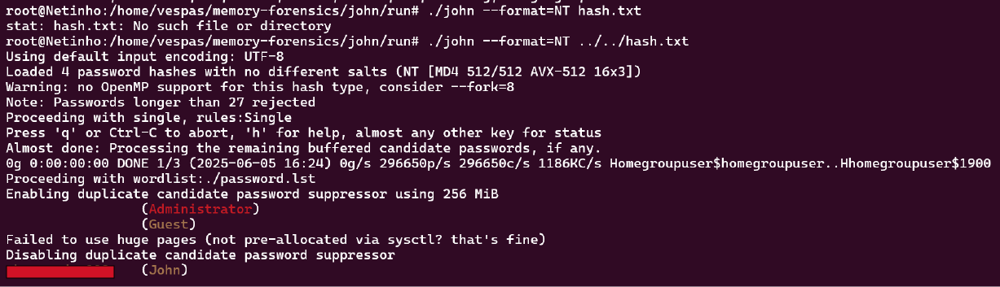
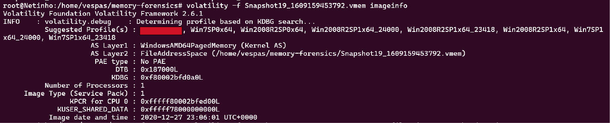
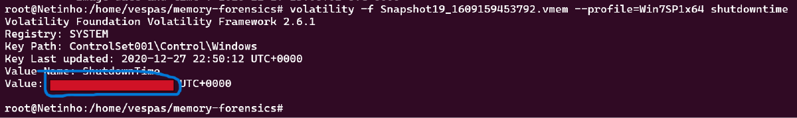
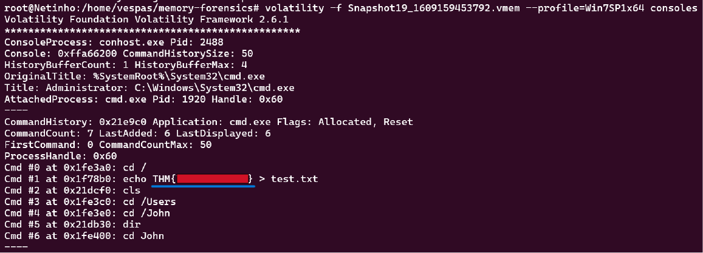
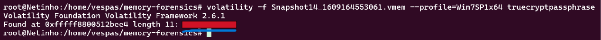

# Memory Forensics

---

>#### Write-Up by VESPAS 
>##### ***Written by:*** Antônio Neto (anetogm)
>##### ***Redacted by:*** Gabriel Rossetto (R0SSETT0)

__

###### É preciso baixar o volatility pra fazer esse desafio.

## Senha do John
### Identificando o Perfil de Sistema
Para começar, precisamos determinar o perfil do sistema operacional do dump de memória. Usaremos a função `imageinfo` do Volatility:
```bash
volatility -f Snapshot6_1609157562389.vmem imageinfo
```
**

### Extraindo Hashes de Senha (hashdump)
Com o perfil identificado, o próximo passo é extrair os hashes das senhas dos usuários. Utilizaremos a função hashdump, especificando o perfil descoberto:
```bash
volatility -f Snapshot6_1609157562389.vmem --profile=[REDACTED] hashdump
```
Focando no usuário John, obtivemos seu hash de senha. Recomendo salvar essa saída em um arquivo de texto (ex: hash.txt) para facilitar a próxima etapa.

**

### Quebrando a Senha com John the Ripper
Para quebrar o hash, execute o seguinte comando:
```bash
john --format=NT hash.txt
```
- PS: tive dificuldade de rodar o comando pra que o john descriptasse a senha, mas usei o GPT e ele resolveu o problema pra que eu conseguisse baixar e rodar o programa

**

## Analyzis
### Identificando o profile com imageinfo
Antes de usar qualquer plugin, precisamos descobrir qual profile utilizar. Para isso, usamos o seguinte comando:
```bash
volatility -f Snapshot19_1609159453792.vmem imageinfo
```
**

### Verificando quando o computador foi desligado
O plugin shutdowntime permite visualizar as últimas vezes que o sistema foi desligado. Com base no profile identificado:
```bash
volatility -f Snapshot19_1609159453792.vmem --profile=[REDACTED] shutdowntime 
```
**

### Encontrando o que ele escreveu no terminal
É necessário rodar o comando consoles dentro do perfil para ver o que estava sendo escrito no momento em que ele estava com o terminal aberto.
```bash
volatility -f Snapshot19_1609159453792.vmem --profile=[REDACTED] consoles
```
**

## TrueCrypt
### Encontrando a senha com o plugin truecryptpassphrase
O Volatility possui um plugin específico para buscar frases secretas de volumes criptografados com TrueCrypt, que podem estar armazenadas em texto puro na memória.

Para isso, executamos:
```bash
volatility -f memory.vmem --profile=[REDACTED] truecryptpassphrase
```
**

### Room finalizada!